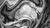
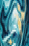
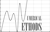

# Image Interpolation Project

This project implements three types of image interpolation methods: **proximal**, **bicubic**, and **Lanczos**. Each method is designed to perform specific transformations on images, such as resizing and rotating, using different interpolation techniques.

---

## **Overview of Methods**

### **Proximal Interpolation**
- Calculates the value of each pixel in the target image by finding the nearest pixel in the source image.
- Includes resizing and rotating transformations with special handling for out-of-bound pixels (e.g., assigning black).

### **Bicubic Interpolation**
- Computes pixel values using cubic polynomials that ensure smooth transitions between pixels.
- Utilizes derivative calculations for higher accuracy and supports operations for each RGB channel separately.

### **Lanczos Interpolation**
- Uses the Lanczos algorithm to compute pixel values by applying sinc-based functions for smooth and precise transformations.
- Employs rational Lanczos procedures to construct bases for Krylov subspaces and iteratively refines results.

---

## **Usage**
This project is implemented in MATLAB. To run the code:

1. Clone the repository:
   ```bash
   git clone https://github.com/mariusprd/image-interpolation.git
   cd image-interpolation
   ```

2. Open MATLAB and navigate to the project directory.

3. Run the corresponding scripts:
   - **Proximal Interpolation**: `proximal/proximal_resize.m`
   - **Bicubic Interpolation**: `bicubic/bicubic_resize.m`
   - **Lanczos Interpolation**: `lanczos/rationalLanczosBlock.m`

4. Input the required data (from `tests/in/`) or modify the scripts for custom inputs.

5. View the output results in the `tests/ref/` folder.

---

## **Results**
The following images showcase the results of the interpolation methods:

### **Proximal Interpolation**
**Input Image**:



**Output Image**:



### **Bicubic Interpolation**
**Input Image**:



**Output Image**:


---

## **Project Structure**
```
.
├── bicubic/          # Bicubic interpolation code and utilities
├── lanczos/          # Lanczos interpolation code and utilities
├── proximal/         # Proximal interpolation code and utilities
├── tests/            # Test cases and input/output data
├── README.md         # Project documentation
```

---

## **Future Work**
- Enhance computational efficiency for larger images.
- Extend the implementation to include additional interpolation techniques.
- Introduce graphical interfaces for easier user interaction.

---
